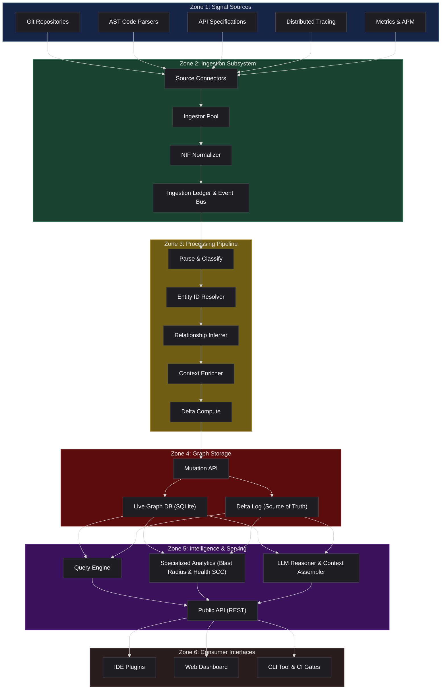
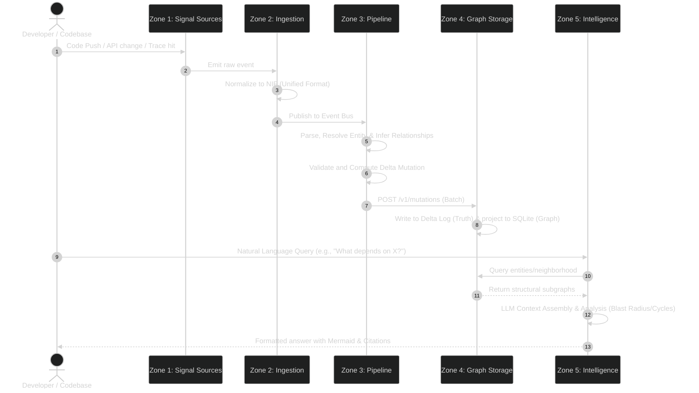

# 🏗️ AI Codebase Knowledge Graph

Welcome to the **AI Codebase Knowledge Graph** repository. This project is a state-of-the-art system designed to capture, store, analyze, and query structural, historical, and runtime details of a software codebase. It turns static code symbols, ownership metadata, runtime telemetry, and Git commit history into a unified, living property graph that can be queried in natural language.

---

## 🗺️ High-Level Architecture (The 6 Zones)

The system is organized into **6 logical zones**, running from signal capture all the way to user interaction interfaces. Here is how they connect:



---

## 🔄 End-to-End Data Flow

The sequence below illustrates how a change in the codebase propagates through the architecture to update the serving layer:



---

## 📦 Project Layout

The repository is structured as a Go multi-module workspace containing the primary MVP components:

* **[cmd/archgraph/](file:///Users/MacBook/Fun_Project/Fun-Project/cmd/archgraph)** — Supervisor tool to coordinate local development.
* **[documentation/](file:///Users/MacBook/Fun_Project/Fun-Project/documentation)** — High-level architecture and system design specs.
  * **[HighLevelArchi.md](file:///Users/MacBook/Fun_Project/Fun-Project/documentation/HighLevelArchi.md)** — Architectural Overview.
  * **[Zone 1 Specifications](file:///Users/MacBook/Fun_Project/Fun-Project/documentation/Zone1.md)** | **[Zone 2 Specifications](file:///Users/MacBook/Fun_Project/Fun-Project/documentation/Zone2.md)** | **[Zone 3 Specifications](file:///Users/MacBook/Fun_Project/Fun-Project/documentation/Zone3.md)**
  * **[Zone 4 Specifications](file:///Users/MacBook/Fun_Project/Fun-Project/documentation/Zone4.md)** | **[Zone 5 Specifications](file:///Users/MacBook/Fun_Project/Fun-Project/documentation/Zone5.md)** | **[Zone 6 Specifications](file:///Users/MacBook/Fun_Project/Fun-Project/documentation/Zone6.md)**
* **[zone4/](file:///Users/MacBook/Fun_Project/Fun-Project/zone4)** — Zone 4 (Graph Storage) Go module.
* **[zone5/](file:///Users/MacBook/Fun_Project/Fun-Project/zone5)** — Zone 5 (Intelligence & Serving Layer) Go module.
* **[zone6/](file:///Users/MacBook/Fun_Project/Fun-Project/zone6)** — Zone 6 (Consumer Interfaces - CLI & MCP Server) Go module.

---

## ⚡ Quick Start: Running the Entire System

A supervisor tool is provided to start all implemented zones in their correct dependency order under a single terminal command. It starts Zone 4 (Graph Storage), waits for it to become healthy, and then boots Zone 5 (Intelligence Layer) pointing to Zone 4.

### Prerequisites

- **Go** (version 1.20 or newer recommended)
- **SQLite3**

### Execution

Run the following commands from the project root:

```bash
cd cmd/archgraph
go run . -root ../..
```

#### Available Flags for the Supervisor:
* `-root` — Path to the project root containing `zone4/` and `zone5/` (default `.`)
* `-zone4-port` — Port for the Zone 4 daemon (default `8080`)
* `-zone5-port` — Port for the Zone 5 daemon (default `8081`)
* `-db` — SQLite database path passed to Zone 4 (default `zone4.db`)
* `-ready-timeout` — Max time to wait for Zone 4 to become healthy (default `30s`)

Once running, you will see prefixed logs (`[zone4]` and `[zone5]`) interleaved readably in your terminal. On termination (`Ctrl+C`), both services will be gracefully shut down.

---

## 🟩 Zone 2 — Ingestion Subsystem (MVP)

Located in **[zone2/](file:///Users/MacBook/Fun_Project/Fun-Project/zone2)**, this module reaches into signal sources (Zone 1), normalizes raw records into a **Normalized Ingestion Format (NIF)**, and delivers them downstream. Source isolation is enforced: nothing downstream knows about Git, filesystems, or AST nodes — only NIF.

### Key Features
* **Source Connectors:** Pull-based connectors that scan local repositories on demand.
* **Ingestors:** Git history extractor (via the system `git` CLI) and Go AST parser (via `go/parser`) that extract entities and relationships from code.
* **NIF Normalization:** Unified type system with deterministic SHA-256 entity IDs and built-in schema validation.
* **Orchestration:** In-process topological DAG runner with concurrent independent branches and partial-failure isolation.
* **Delivery:** `Zone4Sink` (HTTP POST to `/v1/mutations`) or `FileSink` (JSONL for offline testing).
* **Observability:** Append-only ingestion ledger, JSONL dead-letter queue, and on-demand staleness lookups.

### Key Endpoints (Port 8082)
* `POST /v1/runs` — Trigger an ingestion run for a configured source.
* `GET /v1/ledger` — Query the append-only ingestion activity log.
* `GET /v1/staleness` — Check freshness of previously ingested sources.
* `GET /v1/health` — Liveness probe.

For more details, see the **[Zone 2 README](file:///Users/MacBook/Fun_Project/Fun-Project/zone2/README.md)**.

---

## 🟨 Zone 3 — Processing Pipeline (MVP)

Located in **[zone3/](file:///Users/MacBook/Fun_Project/Fun-Project/zone3)**, this module is the intelligence layer between raw ingestion and the graph store. It transforms ambiguous, multi-source NIF records into confident, resolved, enriched graph mutations ready for Zone 4.

### Key Features
* **6-Stage Pipeline:** Records flow through Parse & Classify → Entity Resolution → Relationship Inference → Enrichment → Validation → Delta Computation.
* **Entity Registry:** A dedicated SQLite-backed local registry that tracks canonical IDs, aliases, and resolution history for fast entity deduplication.
* **Confidence Scoring:** Every entity and relationship is scored using multi-signal weighted heuristics (exact match, fuzzy match, structural match, co-occurrence, temporal).
* **Relationship Inference:** Automatically derives hidden dependencies — shared database coupling (`CHANGE_COUPLED_WITH`), transitive structural chains, and runtime co-occurrence patterns.
* **Enrichment:** Computes ownership, velocity, criticality, and maturity scores per entity using configurable scoring rules.
* **Delta Computation:** Compares pipeline output against current graph state (via Zone 4) and emits minimal, batched mutation plans.

### Key Endpoints (Port 8082)
* `POST /v1/ingest` — Submit a batch of NIF records for full pipeline processing.
* `GET /v1/health` — Liveness probe.

For more details, see the **[Zone 3 Specifications](file:///Users/MacBook/Fun_Project/Fun-Project/documentation/Zone3.md)**.

---

## 🟥 Zone 4 — Graph Storage (MVP)

Located in **[zone4/](file:///Users/MacBook/Fun_Project/Fun-Project/zone4)**, this is a single-process, SQLite-backed implementation of the graph storage layer.

### Key Features
* **Mutation API:** A single write entry point that handles batches of mutations, enforces schema validation, and performs optimistic locking.
* **Delta Log:** An append-only, monotonic, queryable transaction ledger that preserves absolute history.
* **Graph Projection:** Live `entities` and `relationships` tables in SQLite derived from the delta log.
* **Neighborhood Queries:** Graph traversals supporting N-hop neighborhood retrievals.

### Key Endpoints (Port 8080)
* `POST /v1/mutations` — Apply a batch of entity/relationship mutations.
* `GET /v1/entities/{id}` — Retrieve an entity by canonical ID.
* `GET /v1/entities/{id}/neighborhood?depth=N` — Retrieve N-hop relationship neighborhood.
* `GET /v1/log?from_entry_id=N&limit=M` — Read the raw delta log entries.

For more details, see the **[Zone 4 README](file:///Users/MacBook/Fun_Project/Fun-Project/zone4/README.md)**.

---

## 🟪 Zone 5 — Intelligence & Serving Layer (MVP)

Located in **[zone5/](file:///Users/MacBook/Fun_Project/Fun-Project/zone5)**, this service is the reasoning brain of the system. It sits on top of Zone 4 and translates graph facts into architectural intelligence.

### Key Features
* **Query Engine:** Parses incoming natural language questions and routes them to Query Archetypes (Structural, Runtime, Temporal, Impact, Governance).
* **Context Assembler:** Fetches relevant subgraphs using weight-based PageRank pruning and formats them into a serialized structure.
* **LLM Reasoner:** Orchestrates responses using LLM prompting (currently stubbed for local testing).
* **Analytical Engines:** 
  * **Blast Radius Engine:** Computes transitive downstream impact of changes.
  * **Health Auditor:** Detects circular dependencies (using Tarjan's Strongly Connected Components) and shared database coupling.
  * **Evolution Tracker:** Compares codebase state over time using delta log replays.

### Key Endpoints (Port 8081)
* `POST /v1/ask` — Ask natural language questions about the codebase.
* `GET /v1/blast-radius?id=X&depth=N` — Compute blast radius of changing entity `X`.
* `GET /v1/health-audit` — Scan the graph for cycles and microservice design violations.
* `GET /v1/diff?from=N&to=M` — Diff the architecture between two log sequences.

For more details, see the **[Zone 5 README](file:///Users/MacBook/Fun_Project/Fun-Project/zone5/README.md)**.

---

## 🟫 Zone 6 — Consumer Interfaces (CLI & MCP)

Located in **[zone6/](file:///Users/MacBook/Fun_Project/Fun-Project/zone6)**, this module contains the user interaction interfaces, acting as both an interactive command-line tool (`archgraph`) and a Model Context Protocol (MCP) server over `stdio`.

### Key CLI Subcommands
* `graph [-format tree|mermaid]` — Visualizes the current codebase dependency tree in the terminal with ANSI colors, or prints copy-pasteable Mermaid flowchart diagrams.
* `query "<question>"` — Interrogates the codebase architecture in natural language via the serving layer.
* `diff <commit1> <commit2>` — Detects and lists architectural drift changes between two Git commits.
* `impact --file <path> [--line <number>]` / `impact <entity_id>` — Traverses downstreams to compute the blast radius of proposed file changes.
* `validate [--detail]` — Audits system topology (cycles, database couplings, service owners) against boundary rules configured in `.archgraph.yaml`.
* `document [--out <file>]` — Dynamically auto-generates comprehensive system documentation, automatically reading and hoisting submodule `README.md` files (README-First approach).

### Embedded Model Context Protocol (MCP) Server
When run via `archgraph mcp`, the binary acts as an MCP server over standard input/output (`stdio`), exposing custom capabilities to AI clients like Cursor, Claude Code, and Gemini CLI:
#### Exposed Tools

| Tool | Description |
|------|-------------|
| `archgraph_audit` | Runs topological audits for cycles and database coupling. |
| `archgraph_get_diff` | Compares commits for architectural mutations. |
| `archgraph_suggestions` | Returns concrete refactoring recommendations to break coupling. |
| `archgraph_blast_radius` | Analyzes impact callers of file changes. |
| `archgraph_ask` | Forwards natural language structural questions to the LLM serving layer. |
| `archgraph_document` | Generates a master system blueprint markdown document. |

#### Exposed Resources

| Resource URI | Description |
|--------------|-------------|
| `archgraph://schema` | Details target entity and relationship definitions. |
| `archgraph://health/summary` | Returns real-time counts of nodes, relationships, cycles, and smells. |
| `archgraph://drift/log` | Streams recent evolution logs. |

---

## 🛠️ Testing & Compilation

Primary modules are fully testable and compile cleanly:

**Compile Zone 6 CLI:**
```bash
cd zone6
go build -o archgraph ./cmd/archgraph-cli
```

**Run Tests:**
* **Zone 4 Graph Storage:**
  ```bash
  cd zone4 && go test ./...
  ```
* **Zone 5 Intelligence Layer:**
  ```bash
  cd zone5 && go test ./...
  ```

