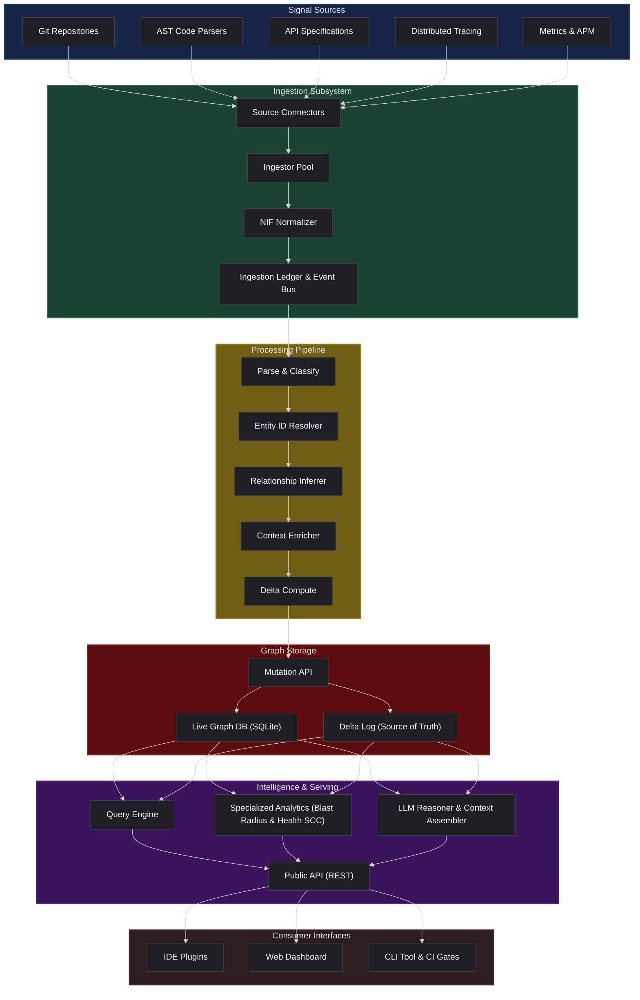
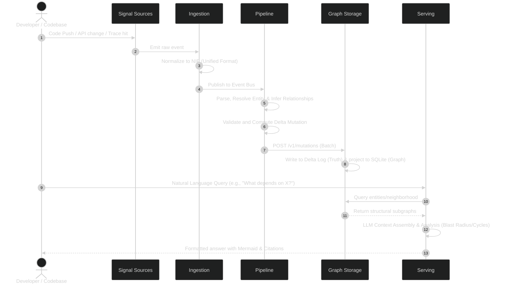

# 🏗️ AI Codebase Knowledge Graph

Welcome to the **AI Codebase Knowledge Graph** repository. This project is a state-of-the-art system designed to capture, store, analyze, and query structural, historical, and runtime details of a software codebase. It turns static code symbols, ownership metadata, runtime telemetry, and Git commit history into a unified, living property graph that can be queried in natural language.

---

## 🗺️ High-Level Architecture (The 6 Components)

The system is organized into **6 logical components**, running from signal capture all the way to user interaction interfaces. Here is how they connect:


```mermaid
%%{init: {'theme': 'dark'}}%%
flowchart TD
    subgraph SignalSources ["Signal Sources"]
        Git["Git Repositories"]
        AST["AST Code Parsers"]
        APIs["API Specifications"]
        Trace["Distributed Tracing"]
        Metrics["Metrics & APM"]
    end

    subgraph Ingestion ["Ingestion Subsystem"]
        Connectors["Source Connectors"]
        Ingestors["Ingestor Pool"]
        NIF["NIF Normalizer"]
        Ledger["Ingestion Ledger & Event Bus"]
    end

    subgraph Pipeline ["Processing Pipeline"]
        Parse["Parse & Classify"]
        Resolve["Entity ID Resolver"]
        Infer["Relationship Inferrer"]
        Enrich["Context Enricher"]
        Delta["Delta Compute"]
    end

    subgraph Storage ["Graph Storage"]
        MutationAPI["Mutation API"]
        GraphDB["Live Graph DB (SQLite)"]
        DeltaLog["Delta Log (Source of Truth)"]
    end

    subgraph Serving ["Intelligence & Serving"]
        QueryEngine["Query Engine"]
        Analytics["Specialized Analytics (Blast Radius & Health SCC)"]
        LLMReason["LLM Reasoner & Context Assembler"]
        PublicAPI["Public API (REST)"]
    end

    subgraph Interfaces ["Consumer Interfaces"]
        IDE["IDE Plugins"]
        WebDash["Web Dashboard"]
        CLI["CLI Tool & CI Gates"]
    end

    %% Data flow connections
    Git & AST & APIs & Trace & Metrics --> Connectors
    Connectors --> Ingestors --> NIF --> Ledger
    Ledger --> Parse --> Resolve --> Infer --> Enrich --> Delta
    Delta --> MutationAPI
    MutationAPI --> GraphDB & DeltaLog
    GraphDB & DeltaLog --> QueryEngine & Analytics & LLMReason
    QueryEngine & Analytics & LLMReason --> PublicAPI
    PublicAPI --> IDE & WebDash & CLI

    %% Subgraph Styling
    style SignalSources fill:#162447,stroke:#1f4068,stroke-width:2px,color:#e4e4e4
    style Ingestion fill:#1b4332,stroke:#2d6a4f,stroke-width:2px,color:#e4e4e4
    style Pipeline fill:#6f5e13,stroke:#9a7b1c,stroke-width:2px,color:#e4e4e4
    style Storage fill:#5c0c0c,stroke:#7f1d1d,stroke-width:2px,color:#e4e4e4
    style Serving fill:#3b135c,stroke:#521c7d,stroke-width:2px,color:#e4e4e4
    style Interfaces fill:#2b1d1d,stroke:#3d2b2b,stroke-width:2px,color:#e4e4e4

    %% Node Styling Class for Dark Mode Contrast
    classDef darkNode fill:#1e1e24,stroke:#44444c,stroke-width:1px,color:#ffffff;
    class Git,AST,APIs,Trace,Metrics,Connectors,Ingestors,NIF,Ledger,Parse,Resolve,Infer,Enrich,Delta,MutationAPI,GraphDB,DeltaLog,QueryEngine,Analytics,LLMReason,PublicAPI,IDE,WebDash,CLI darkNode;
```

---

## 🔄 End-to-End Data Flow

The sequence below illustrates how a change in the codebase propagates through the architecture to update the serving layer:


```mermaid
%%{init: {'theme': 'dark'}}%%
sequenceDiagram
    autonumber
    actor Dev as Developer / Codebase
    participant Z1 as Signal Sources
    participant Z2 as Ingestion
    participant Z3 as Pipeline
    participant Z4 as Graph Storage
    participant Z5 as Serving

    Dev->>Z1: Code Push / API change / Trace hit
    Z1->>Z2: Emit raw event
    Z2->>Z2: Normalize to NIF (Unified Format)
    Z2->>Z3: Publish to Event Bus
    Z3->>Z3: Parse, Resolve Entity & Infer Relationships
    Z3->>Z3: Validate and Compute Delta Mutation
    Z3->>Z4: POST /v1/mutations (Batch)
    Z4->>Z4: Write to Delta Log (Truth) & project to SQLite (Graph)
    Dev->>Z5: Natural Language Query (e.g., "What depends on X?")
    Z5->>Z4: Query entities/neighborhood
    Z4-->>Z5: Return structural subgraphs
    Z5->>Z5: LLM Context Assembly & Analysis (Blast Radius/Cycles)
    Z5-->>Dev: Formatted answer with Mermaid & Citations
```

---

## 📦 Project Layout

The repository is structured as a Go multi-module workspace containing the primary MVP components:

* **[cmd/archgraph/](file:///Users/MacBook/Fun_Project/Fun-Project/cmd/archgraph)** — Supervisor tool to coordinate local development.
* **[documentation/](file:///Users/MacBook/Fun_Project/Fun-Project/documentation)** — High-level architecture and system design specs.
  * **[HighLevelArchi.md](file:///Users/MacBook/Fun_Project/Fun-Project/documentation/HighLevelArchi.md)** — Architectural Overview.
  * **[Signal Sources Specifications](file:///Users/MacBook/Fun_Project/Fun-Project/documentation/signal_sources.md)** | **[Ingestion Specifications](file:///Users/MacBook/Fun_Project/Fun-Project/documentation/ingestion.md)** | **[Pipeline Specifications](file:///Users/MacBook/Fun_Project/Fun-Project/documentation/pipeline.md)**
  * **[Storage Specifications](file:///Users/MacBook/Fun_Project/Fun-Project/documentation/storage.md)** | **[Serving Specifications](file:///Users/MacBook/Fun_Project/Fun-Project/documentation/serving.md)** | **[Interfaces Specifications](file:///Users/MacBook/Fun_Project/Fun-Project/documentation/interfaces.md)**
* **[storage/](file:///Users/MacBook/Fun_Project/Fun-Project/zone4)** — Storage (Graph Storage) Go module.
* **[serving/](file:///Users/MacBook/Fun_Project/Fun-Project/zone5)** — Serving (Intelligence & Serving Layer) Go module.
* **[interfaces/](file:///Users/MacBook/Fun_Project/Fun-Project/zone6)** — Interfaces (Consumer Interfaces - CLI & MCP Server) Go module.

---

## ⚡ Quick Start: Running the Entire System

A supervisor tool is provided to start all implemented zones in their correct dependency order under a single terminal command. It starts Storage (Graph Storage), Pipeline (Processing Pipeline), Ingestion (Ingestion), and Serving (Intelligence Layer), wiring the default ingestion path as Ingestion → Pipeline → Storage.

### Prerequisites

- **Go** (version 1.22 or newer recommended)
- **SQLite3**

### Execution

Run the following commands from the project root:

```bash
cd cmd/archgraph
go run . -root ../..
```

To scan a specific project folder or repository and print a CLI graph:

```bash
./run-archgraph.sh /path/to/project local-dev
```

Git metadata is ingested when the target is a Git worktree. Supported AST ingestion currently covers Go projects, including plain folders without `.git`.

### Developer Checks

This repository is a Go workspace made of multiple modules, so `go test ./...` from the repository root is not the right command. Use the root Makefile fan-out targets instead:

```bash
make test
make vet
make build
make check
```

#### Available Flags for the Supervisor:
* `-root` — Path to the project root containing `ingestion/`, `pipeline/`, `storage/`, and `serving/` (default `.`)
* `-zone2-port` — Port for the Ingestion daemon (default `8083`)
* `-zone3-port` — Port for the Pipeline daemon (default `8082`)
* `-zone4-port` — Port for the Storage daemon (default `8080`)
* `-zone5-port` — Port for the Serving daemon (default `8081`)
* `-db` — SQLite database path passed to Storage (default `storage.db`)
* `-pipeline-db` — SQLite registry database path passed to Pipeline (default `pipeline.db`)
* `-zone2-config` — Source config passed to Ingestion (empty scans supervisor CWD)
* `-ready-timeout` — Max time to wait for Storage to become healthy (default `30s`)

Once running, you will see prefixed logs (`[zone2]`, `[zone3]`, `[zone4]`, and `[zone5]`) interleaved readably in your terminal. On termination (`Ctrl+C`), all services will be gracefully shut down.

---

## 🟩 Ingestion — Ingestion Subsystem (MVP)

Located in **[ingestion/](file:///Users/MacBook/Fun_Project/Fun-Project/zone2)**, this module reaches into signal sources (Signal Sources), normalizes raw records into a **Normalized Ingestion Format (NIF)**, and delivers them downstream. Source isolation is enforced: nothing downstream knows about Git, filesystems, or AST nodes — only NIF.

### Key Features
* **Source Connectors:** Pull-based connectors that scan local repositories on demand.
* **Ingestors:** Git history extractor (via the system `git` CLI) and Go AST parser (via `go/parser`) that extract entities and relationships from code.
* **NIF Normalization:** Unified type system with deterministic SHA-256 entity IDs and built-in schema validation.
* **Orchestration:** In-process topological DAG runner with concurrent independent branches and partial-failure isolation.
* **Delivery:** `Zone3Sink` (HTTP POST to `/v1/ingest`) by default, `Zone4Sink` only for direct debug/dev writes, or `FileSink` (JSONL for offline testing).
* **Observability:** Append-only ingestion ledger, JSONL dead-letter queue, and on-demand staleness lookups.

### Key Endpoints (Port 8083)
* `POST /v1/runs` — Trigger an ingestion run for a configured source.
* `GET /v1/ledger` — Query the append-only ingestion activity log.
* `GET /v1/staleness` — Check freshness of previously ingested sources.
* `GET /v1/health` — Liveness probe.

For more details, see the **[Ingestion README](file:///Users/MacBook/Fun_Project/Fun-Project/ingestion/README.md)**.

---

## 🟨 Pipeline — Processing Pipeline (MVP)

Located in **[pipeline/](file:///Users/MacBook/Fun_Project/Fun-Project/zone3)**, this module is the intelligence layer between raw ingestion and the graph store. It transforms ambiguous, multi-source NIF records into confident, resolved, enriched graph mutations ready for Storage.

### Key Features
* **6-Stage Pipeline:** Records flow through Parse & Classify → Entity Resolution → Relationship Inference → Enrichment → Validation → Delta Computation.
* **Entity Registry:** A dedicated SQLite-backed local registry that tracks canonical IDs, aliases, and resolution history for fast entity deduplication.
* **Confidence Scoring:** Every entity and relationship is scored using multi-signal weighted heuristics (exact match, fuzzy match, structural match, co-occurrence, temporal).
* **Relationship Inference:** Automatically derives hidden dependencies — shared database coupling (`CHANGE_COUPLED_WITH`), transitive structural chains, and runtime co-occurrence patterns.
* **Enrichment:** Computes ownership, velocity, criticality, and maturity scores per entity using configurable scoring rules.
* **Delta Computation:** Compares pipeline output against current graph state (via Storage) and emits minimal, batched mutation plans.

### Key Endpoints (Port 8082)
* `POST /v1/ingest` — Submit a batch of NIF records for full pipeline processing.
* `GET /v1/health` — Liveness probe.

For more details, see the **[Pipeline Specifications](file:///Users/MacBook/Fun_Project/Fun-Project/documentation/pipeline.md)**.

---

## 🟥 Storage — Graph Storage (MVP)

Located in **[storage/](file:///Users/MacBook/Fun_Project/Fun-Project/zone4)**, this is a single-process, SQLite-backed implementation of the graph storage layer.

### Key Features
* **Mutation API:** A single write entry point that handles batches of mutations, enforces schema validation, and performs optimistic locking.
* **Delta Log:** An append-only, monotonic, queryable transaction ledger that preserves absolute history.
* **Graph Projection:** Live `entities` and `relationships` tables in SQLite derived from the delta log.
* **Neighborhood Queries:** Graph traversals supporting N-hop neighborhood retrievals.

### Key Endpoints (Port 8080)
* `POST /v1/mutations` — Apply a batch of entity/relationship mutations.
* `GET /v1/entities/{id}` — Retrieve an entity by canonical ID.
* `GET /v1/entities/{id}/neighborhood?depth=N` — Retrieve N-hop relationship neighborhood.
* `GET /v1/log?from_entry_id=N&limit=M` — Read the raw delta log entries.

For more details, see the **[Storage README](file:///Users/MacBook/Fun_Project/Fun-Project/storage/README.md)**.

---

## 🟪 Serving Layer (MVP)

Located in **[serving/](file:///Users/MacBook/Fun_Project/Fun-Project/zone5)**, this service is the reasoning brain of the system. It sits on top of Storage and translates graph facts into architectural intelligence.

### Key Features
* **Query Engine:** Parses incoming natural language questions and routes them to Query Archetypes (Structural, Runtime, Temporal, Impact, Governance).
* **Context Assembler:** Fetches relevant subgraphs using weight-based PageRank pruning and formats them into a serialized structure.
* **LLM Reasoner:** Orchestrates responses using LLM prompting (currently stubbed for local testing).
* **Analytical Engines:** 
  * **Blast Radius Engine:** Computes transitive downstream impact of changes.
  * **Health Auditor:** Detects circular dependencies (using Tarjan's Strongly Connected Components) and shared database coupling.
  * **Evolution Tracker:** Compares codebase state over time using delta log replays.

### Key Endpoints (Port 8081)
* `POST /v1/ask` — Ask natural language questions about the codebase.
* `GET /v1/blast-radius?id=X&depth=N` — Compute blast radius of changing entity `X`.
* `GET /v1/health-audit` — Scan the graph for cycles and microservice design violations.
* `GET /v1/diff?from=N&to=M` — Diff the architecture between two log sequences.

For more details, see the **[Serving README](file:///Users/MacBook/Fun_Project/Fun-Project/serving/README.md)**.

---

## 🟫 Consumer Interfaces (CLI & MCP)

Located in **[interfaces/](file:///Users/MacBook/Fun_Project/Fun-Project/zone6)**, this module contains the user interaction interfaces, acting as both an interactive command-line tool (`archgraph`) and a Model Context Protocol (MCP) server over `stdio`.

### Key CLI Subcommands

| Command | Description |
|---------|-------------|
| `graph [-format tree\|mermaid]` | Visualizes the codebase dependency tree in the terminal with ANSI colors, or prints a copy-pasteable Mermaid flowchart diagram. |
| `query "<question>"` | Interrogates the codebase architecture in natural language via the serving layer. |
| `diff <commit1> <commit2>` | Detects and lists architectural drift changes between two Git commits. |
| `impact --file <path> [--line <number>]` / `impact <entity_id>` | Traverses downstreams to compute the blast radius of proposed file changes. |
| `validate [--detail]` | Audits system topology (cycles, database couplings, service owners) against boundary rules configured in `.archgraph.yaml`. |
| `document [--out <file>]` | Dynamically auto-generates comprehensive system documentation, hoisting submodule `README.md` files (README-First approach). |

### Embedded Model Context Protocol (MCP) Server
When run via `archgraph mcp`, the binary acts as an MCP server over standard input/output (`stdio`), exposing custom capabilities to AI clients like Cursor, Claude Code, and Gemini CLI:
#### Exposed Tools

| Tool | Description |
|------|-------------|
| `archgraph_audit` | Runs topological audits for cycles and database coupling. |
| `archgraph_get_diff` | Compares commits for architectural mutations. |
| `archgraph_suggestions` | Returns concrete refactoring recommendations to break coupling. |
| `archgraph_blast_radius` | Analyzes impact callers of file changes. |
| `archgraph_ask` | Forwards natural language structural questions to the LLM serving layer. |
| `archgraph_document` | Generates a master system blueprint markdown document. |

#### Exposed Resources

| Resource URI | Description |
|--------------|-------------|
| `archgraph://schema` | Details target entity and relationship definitions. |
| `archgraph://health/summary` | Returns real-time counts of nodes, relationships, cycles, and smells. |
| `archgraph://drift/log` | Streams recent evolution logs. |

---

## 🛠️ Testing & Compilation

Primary modules are fully testable and compile cleanly:

**Compile Interfaces CLI:**
```bash
cd zone6
go build -o archgraph ./cmd/archgraph-cli
```

**Run Tests:**
* **Storage Graph Storage:**
  ```bash
  cd zone4 && go test ./...
  ```
* **Serving Intelligence Layer:**
  ```bash
  cd zone5 && go test ./...
  ```
